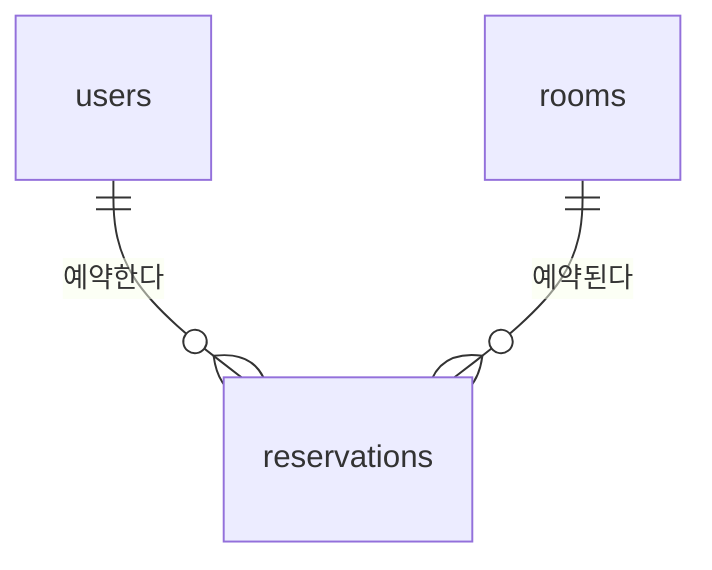

# 데이터베이스 설계

## 핵심 관계

```mermaid
erDiagram
    users ||--o{ reservations : "예약한다"
    rooms ||--o{ reservations : "예약된다"
```

## 테이블 역할

| 테이블 | 역할 |
|---|---|
| users | 일반 회원과 관리자 정보 |
| rooms | 방 이름과 시설 설명 |
| reservations | 누가 어떤 방을 언제 예약했는지 기록 |